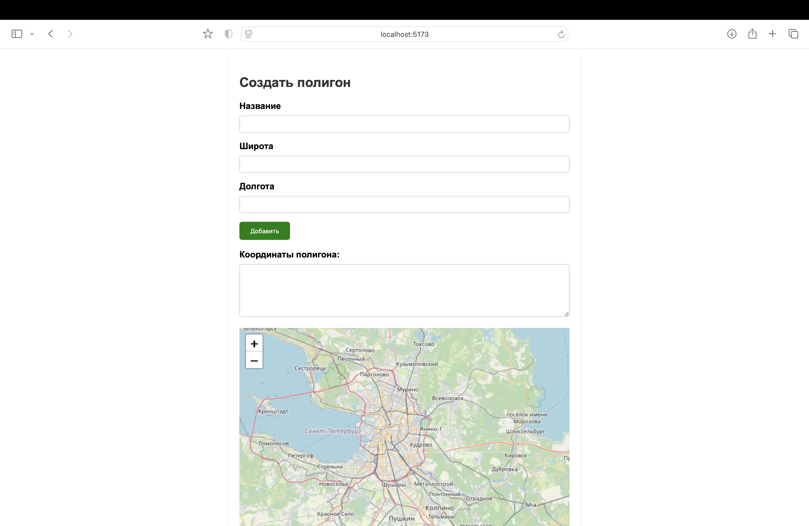

# Polygon management apps

***

### Технологии

- Бэкенд: Django + Django REST framework
- Фронтенд: React js
- БД: PostgreSQL

### Расширения + доп. библиотеки:

- PostGIS - расширение для PostgreSQL БД для работы с географическими объектами
- geos - векторизованные геометрические операции
- gdal - расширяет возможности фреймворка для работы с геопространственными данными
- leaflet-django + leaflet-react - библиотека для отображения карт

### Frontend

-[x] Web страничка с формой (название, полигон) и картой (leaflet.js):
    - [x] По нажатию на кнопку «Добавить» данные -> textarea.
      
    - [x] Предусмотреть возможные ошибки, и, если пользователь её допускает - выводить надпись об ошибке. Отобразить
      пришедшие уведомления в всплывающем окне.
      
      
    - [x] По нажатию на кнопку «Submit» данные формы отправляются на сервер и сохраняются в БД в виде
      PolygonField.
      
      
    - [ ] _TODO: Добавить на карте поиск по названию полигона. При вводе названия карта центрируется на полигон и
      выводит
      его название._

- [x] Web-табличка в которой есть все сохраненные объекты:
    - [x] Колонки: Название, Полигон в виде списка координат, признак пересечения антимеридиана (True/False).
      
    - [ ] _TODO: Координаты могут пересекать антимеридиан. И в данном случае нужно преобразовать выделенные координаты и
      проставить признак того что полигон проходит через антимеридиан._
    - [x] При выборе конкретного полигона необходимо отобразить этот полигон на карте.
      
      

### Backend 1

- [x] Создать endpoint для запросов на удаление, добавление, просмотр и _TODO: редактирование_.
- [ ] _TODO: При добавлении новой записи отправлять на проверку полигоны на backend 2. Если полигон не прошел проверку,
  сохранять его в отдельную таблицу с координатами пересечения с другими полигонами._
- [ ] _TODO: Реализовать функционал отправки сообщений о том, что запись в базу данных не произведена._
- [ ] _TODO: На карте они должны отобразиться в отдельной таблице и при «детализации» показать полигоны и их пересечения
  на
  карте._

**Дополнительно:**

- [x] Добавить панель авторизации/регистрации пользователя:
    - [x] Cозданный полигон доступен текущему пользователю.
    - [x] Cвязать пользователя и полигон связью многие ко многим через промежуточную таблицу, в которой сохраняем время
      создания полигона.
    - [x] В списке просмотра полигонов отображать только те полигоны, что доступны текущему пользователю.

### Backend 2

- [x] Реализовать проверку при поступлении новых полигонов с Backend 1 до сохранения в базу данных на предмет
  пересечения с другими полигонами и вернуть результат на Backend 1. 
